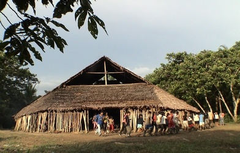

# Multi-CAST Bora

## How to cite

If you use these data please cite
- the original source
  > Seifart, Frank & Hong, Tai. 2023. Multi-CAST Bora. In Haig, Geoffrey & Schnell, Stefan (eds.), Multi-CAST: Multilingual corpus of annotated spoken texts. Version 2311. Bamberg: University of Bamberg. (multicast.aspra.uni-bamberg.de/#bora) (date accessed)
- the derived dataset using the DOI of the [particular released version](../../releases/) you were using



## Description


**Bora** ([bora1263](https://glottolog.org/resource/languoid/id/bora1263)) Bora is a Boran language spoken in various small communities in the Colombian and Peruvian Amazon region (e.g. 3.23°S 71.99°W, 1.75°S 72.50°W). The language has approximately 1 000 speakers, almost all of whom are bilingual in local Spanish. The number of children acquiring Bora is currently decreasing.

Bora has been extensively documented within a VolkswagenStiftung-funded [DOBES documentation project](https://hdl.handle.net/1839/42550453-b3db-4d83-b30f-3bce5304588e) (2005–2009). The Multi-CAST Bora corpus consists of two folkloristic narrative texts taken from the larger DOBES collection. They were recorded and annotated by Frank Seifart in collaboration with, especially, Clever Panduro (original transcription and translation) and Lena Sell (original morphological glossing). Annotations with GRAID and RefIND were added to the corpus in 2021–2022 by Tai Hong in collaboration with Frank Seifart.

The Multi-CAST Bora texts (version 2207) also constitute a part of the [Bora data set](https://doreco.huma-num.fr/languages/bora1263) in [DoReCo](https://doreco.huma-num.fr/), which has been time-aligned at the phone level.

This dataset is licensed under a CC-BY-4.0 license

Available online at https://multicast.aspra.uni-bamberg.de/#bora


```geojson
{
    "type": "FeatureCollection",
    "features": [
        {
            "type": "Feature",
            "geometry": {
                "type": "Point",
                "coordinates": [
                    -72.257066,
                    -2.000259
                ]
            }
        },
        {
            "type": "Feature",
            "geometry": {
                "type": "Polygon",
                "coordinates": [
                    [
                        [
                            -77.257066,
                            2.999741
                        ],
                        [
                            -67.257066,
                            2.999741
                        ],
                        [
                            -67.257066,
                            -7.000259
                        ],
                        [
                            -77.257066,
                            -7.000259
                        ],
                        [
                            -77.257066,
                            2.999741
                        ]
                    ]
                ]
            }
        }
    ]
}
```


## Corpus metadata

- [Annotation notes](cldf/media/annotation-notes.pdf)
- [Translated texts](cldf/media/translated-texts.pdf)


## CLDF Datasets

The following CLDF datasets are available in [cldf](cldf):

- CLDF [TextCorpus](https://github.com/cldf/cldf/tree/master/modules/TextCorpus) at [cldf/TextCorpus-metadata.json](cldf/TextCorpus-metadata.json)